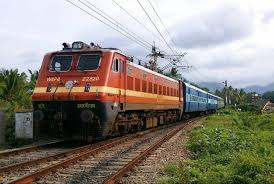
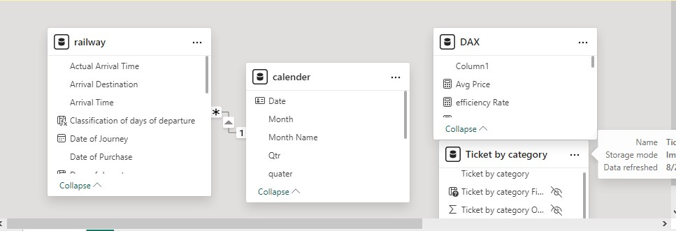
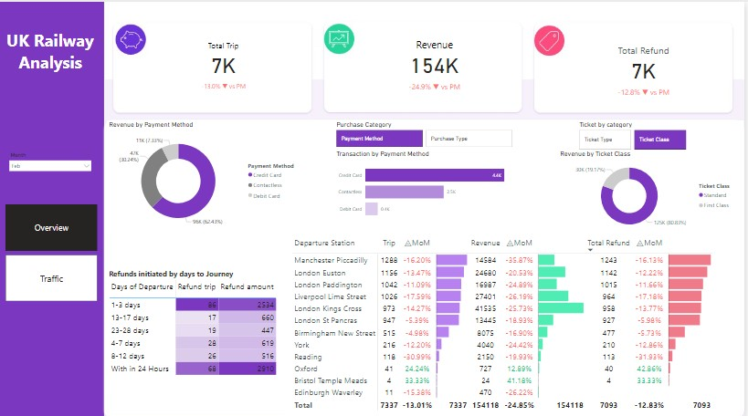
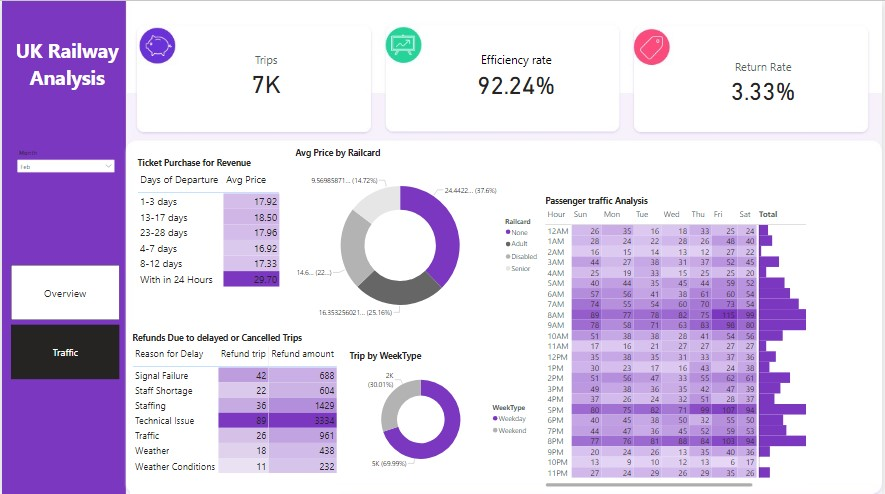

# Railway Analysis

## Introduction
The Railway dataset is a comprehensive collection of information related to train ticket transactions, including the purchase process, journey details, and travel outcomes. It captures data from various stages of a train journey, providing insights into customer behavior, ticketing trends, operational performance, and the impact of delays on customer satisfaction.

**_Disclaimer_**: This dataset and reports does not represent any company, but just a dummy dataset to demonstrate capabilities of Power BI
## Statement of Problem 
- Operational Issues
- Revenue Fluctuations
- Customer Experience
- Payment Method Impact
## Data Structure 
The dataset was gotten from Maven Analytics and was clean and data integrity and quality was checked. 
- **Transaction ID**: This field is critical for identifying and tracking each individual transaction within the dataset. It is used for linking different aspects of a journey to a specific ticket purchase.
  
- **Date and Time of Purchase**: These fields allow for the analysis of purchasing patterns, such as peak times for ticket purchases or correlations between the time of purchase and journey delays.

- **Purchase Type**: Understanding where tickets are purchased (online vs. station) can provide insights into customer preferences and the effectiveness of online ticketing platforms.

- **Payment Method**: This field provides data on the preferred payment methods among passengers, which can inform payment infrastructure decisions.

- **Railcard**: Captures whether the passenger utilized a discount card, which can be important for understanding pricing structures and demographic usage.

- **Ticket Class & Ticket Type**: These fields describe the type of service the passenger opted for, which can be linked to customer satisfaction and pricing strategies.

- **Price**: Essential for financial analysis, pricing strategies, and understanding the distribution of ticket costs across different classes and types.

- **Departure & Arrival Stations**: These fields identify the start and end points of the journey, crucial for route analysis, demand forecasting, and infrastructure planning.

- **Date of Journey**: Allows analysis of travel patterns across different dates, such as peak travel periods and their impact on service performance.

- **Departure, Arrival, & Actual Arrival Time**: These times provide data on the punctuality of services, enabling the analysis of delays and their impact on customer satisfaction.

- **Journey Status**: A simple indicator of whether the journey was on time, providing a quick overview of service performance.

- **Reason for Delay**: Offers qualitative insights into operational challenges, allowing for targeted improvements.

- **Refund Request**: Indicates whether the journey issues led to financial compensation requests, which can be used to assess customer service impacts.

## Modelling 
The model is star schema 

there is 1 fact table and 1 dimension table which was connected to each other one to many relationship. 

## Visualization 
You can interact with the report here [here](https://app.powerbi.com/view?r=eyJrIjoiNTUzZmZiNjktYmQ0My00YmFhLTkxYTEtNWExNzA4M2I0OGRkIiwidCI6ImRmODY3OWNkLWE4MGUtNDVkOC05OWFjLWM4M2VkN2ZmOTVhMCJ9)

the report contain two pages which is :
Overview 

Traffic 

## **1. Key Metrics Overview**
- **Trips**: A total of 7,000 trips were recorded in February. we have 32000 trip total 
- **Efficiency Rate**: The overall efficiency rate was high at 92.24%, indicating that the majority of trips were completed without significant delays or cancellations.
- **Return Rate**: The return rate was relatively low at 3.33%, showing that only a small percentage of trips resulted in a refund.

## **2. Ticket Purchase and Revenue Analysis**
- **Revenue by Purchase Timing**:
  - Tickets purchased within 24 hours of departure were the most expensive, with an average price of £29.79.
  - Tickets bought 13-17 days before departure were slightly cheaper, averaging £18.50.
  - The lowest average prices were for tickets purchased 4-7 days in advance, at £16.92.

- **Revenue by Railcard**:
  - A significant portion of the revenue came from passengers without railcards, who paid an average price of £44.42.
  - Passengers with railcards like "Adult" and "Disabled" contributed to lower average prices, reflecting the impact of railcard discounts.

### **3. Passenger Traffic Analysis**
- **Traffic by Hour and Day**:
  - The heatmap revealed that peak passenger traffic occurred between 7 AM and 9 AM, and again from 5 PM to 6 PM, which aligns with typical commuting hours.
  - The busiest days were weekdays, especially Tuesday and Wednesday, while weekends saw lower traffic volumes.
  
- **Traffic by Week Type**:
  - There was a clear distinction between weekday and weekend traffic, with weekdays accounting for the majority of trips (80.75%).

### **4. Refund Analysis**
- **Refunds Due to Delays**:
  - The highest number of refunds were requested due to signal failures (42 requests) and staff shortages (22 requests).
  - The majority of refunds were for trips delayed by more than 1 day or for trips that were canceled within 24 hours of departure.

- **Refunds by Timing**:
  - Trips that were canceled or delayed within 24 hours of departure saw the highest refund amounts, followed by those canceled 1-3 days before departure.

### **5. Payment and Purchase Method Insights**
- **Payment Method Distribution**:
  - Credit cards were the dominant payment method, accounting for 60% of all transactions.
  - Contactless payments also had a significant share at 25.4%.

- **Revenue and Refund by Payment Method**:
  - Transactions via credit cards contributed the most to revenue, but they also accounted for a large portion of refunds, suggesting that credit card users might be more likely to request refunds when issues arise.

### **6. Station and Route Analysis**
- **Top Stations**:
  - Manchester Piccadilly, London Euston, and London Paddington were the top stations in terms of trip count.
  - Revenue was highest from trips departing from Manchester Piccadilly and London Euston.

- **Station Performance**:
  - Stations like Liverpool Lime Street and London Kings Cross also contributed significantly to overall revenue but had noticeable refund rates, particularly London Euston, with 1,433 refunds.

- **Month-over-Month (MoM) Changes**:
  - There was a decline in trips, revenue, and refunds across most major stations in February, possibly due to seasonal factors or other external influences on travel behavior.

### **7. Overall Insights**
- **Operational Efficiency**: Despite the high efficiency rate, the presence of refunds due to delays and cancellations indicates room for operational improvement, particularly in addressing issues like signal failures and staff shortages.
- **Customer Behavior**: Passengers were more likely to pay higher prices for last-minute purchases, but there is a clear benefit in offering early-bird pricing incentives. Railcards effectively reduced average prices, making travel more accessible to specific demographics.
- **Revenue Generation**: High-traffic stations such as Manchester Piccadilly and London Euston were key revenue drivers, but managing customer satisfaction at these hubs is crucial given their high refund rates.
- **Strategic Focus**: Efforts could be made to reduce the reasons for refunds by addressing the most frequent causes of delays, such as signal failures and staffing issues. Additionally, enhancing the customer experience during peak hours and days could help in improving the return rate.

These insights can guide strategic decisions around pricing, customer service, operational efficiency, and resource allocation within the railway system for the month of February.

